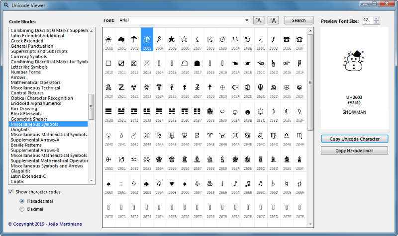
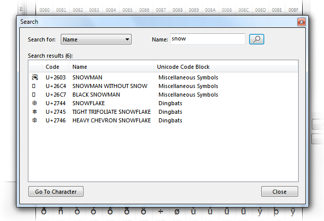

# Unicode Viewer

Unicode Viewer is a small application, written in C#, that lets the user search for and view Unicode characters.

I wrote it because sometime ago I needed to find some Unicode characters (and also because it seemed like an interesting little side project).

You can [download the installer files](https://github.com/joaomartiniano/UnicodeViewer/releases/latest) or clone this repository to build it on Visual Studio.

**Please note**

This application only shows the Unicode characters in the range U+0000 through U+FFFF.

## User Interface

The user interface is quite simple:

- the user selects a Unicode code block, from the **Code Blocks** list
- the corresponding Unicode characters are displayed on a grid
- by clicking on any character of the grid, a preview is displayed on the right side of the window, along with the name and hexadecimal code

### Searching

On the **Search** window the user can search for Unicode characters.

The user can search for:
- a character name (any character that contains the specified text)
- a Unicode character (just paste a Unicode character into the textbox)
- a Unicode code point (insert a four digit hexadecimal code, like 00B6)

Double-clicking on an item of the results list or clicking on the **Go To Character** button selects that character in the main window.